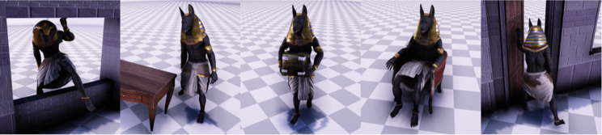
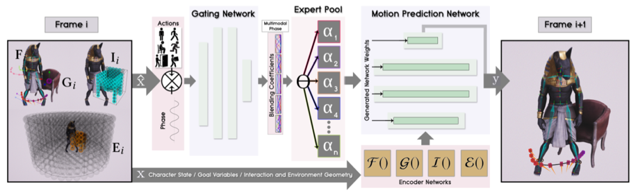
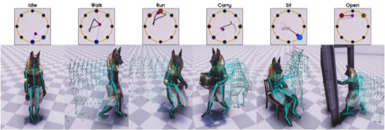

# NSM_pytorch

This project reproduces the pytorch version of Siggraph 2019  [Neural State Machine for Character-Scene Interactions](https://www.ipab.inf.ed.ac.uk/cgvu/nsm.pdf). 

The Github of tensorflow [Neural State Machine for Character-Scene Interactions](https://github.com/sebastianstarke/AI4Animation/tree/master/AI4Animation/SIGGRAPH_Asia_2019).




##  Requirement

torch==1.2.0

## Usage

train model
```shell script
python main.py --cache
```

test model
```shell script
python main.py --test
```

## Result

